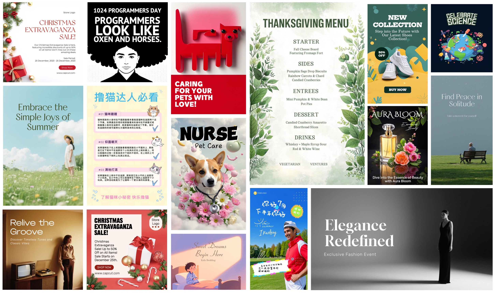

<!-- PROJECT LOGO -->
 

<h3 align="center">CreatiPoster: Towards Editable and Controllable Multi-Layer Graphic Design Generation</h3>

  <a href="https://zhaozhang.net/">Zhao Zhang</a>, Yutao Cheng, Dexiang Hong, <a href="https://dblp.org/pid/210/5108.html">Maoke Yang</a>, 
  Gonglei Shi, Lei Ma, Hui Zhang, Jie Shao, and Xinglong Wu 
  <a href="#"><strong>[arXiv 📚]</strong></a> 
  <a href="#"><strong>[Model ⚙️]</strong></a> 
  <a href="#"><strong>[Results 🖼️]</strong></a> 
  <a href="#bib"><strong>[Bibtex 🔗]</strong></a>

***
This repository open-sources CreatiPoster, an AI-driven graphic design generation system that supports multi-layer and editable compositions with strong visual appeal.

 

Example of editing a graphic composition in the CreatiPoster editor. Users can modify text, assets, layout, and style through an intuitive GUI with JSON field controls, enabling professional-level customization.

 

## News
[2024/06/13] Our manuscript is now available on <a href="#">arXiv</a>.

## To-Do List
- [ ] Release the training/inference code
- [ ] Release the CreatiPoster-F checkpoint.
- [ ] Release training dataset and eval set.

## Method
Overview of the CreatiPoster pipeline: User inputs are processed by the protocol model to generate editable design layers, while the background model creates a complementary background. The final graphic composition integrates both outputs seamlessly.

## Show Cases

### Different interaction modes
CreatiPoster supports diverse interaction modes, including prompt-only, asset-only, mixed input, and explicit specification of text/asset layout or attributes.

### Animated poster
CreatiPoster can extend static graphic compositions to animated posters. Videos are generated from background layers using an image-to-video model.

### Multilingual poster
CreatiPoster's multilingual capabilities: Despite training data only including Simplified Chinese and English graphic compositions, pre-training and multilingual fine-tuning enable the protocol model to generalize to other languages.

### Text overlay
Our protocol model enables direct text overlay on uploaded assets without needing the background model. This is ideal for tasks like adding titles to e-commerce product images or text overlays on social media photos.

### Poster re-layout
Given an original graphic design, CreatiPoster generates alternative layouts of various sizes while preserving content and style. By reusing rendered layers and predicting new foreground/background elements, this approach enables efficient adaptation of designs for different platforms.

## Application
This system has been integrated into [Pippit AI](http://pippit.capcut.com) to power its poster generation capabilities. 

